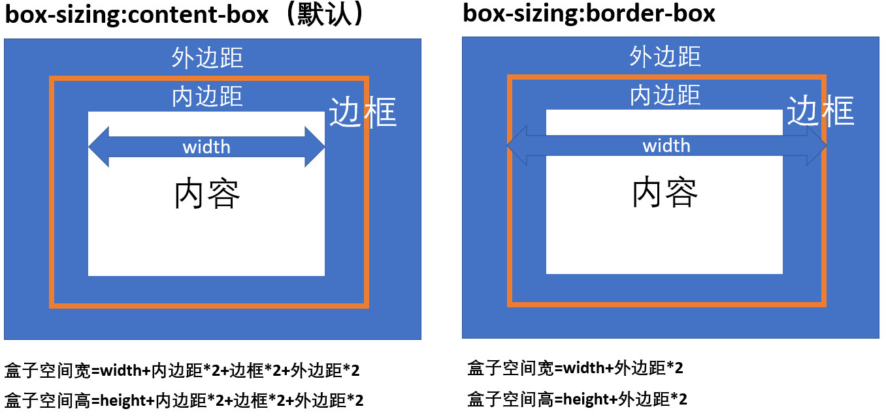
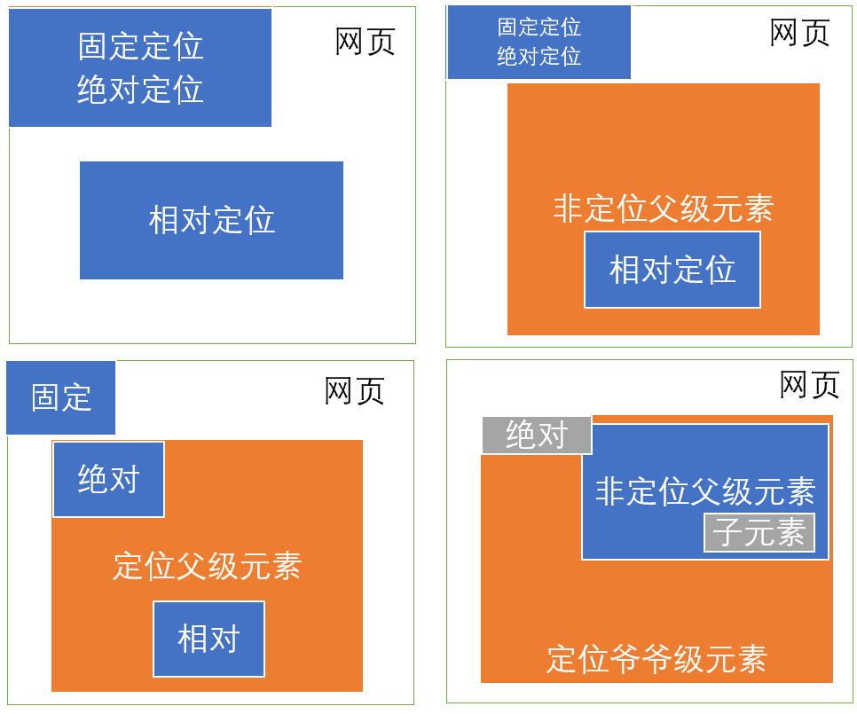

[[toc]]

# 网页由什么组成的？
网页都是由**盒子**组成的

# 盒子的种类有那些？
**块级盒子** 独占一行，可以设置宽和高\
**行内盒子** 随着内容的宽度，不可以设置宽和高

# 如何更改盒子的特性？
**display:inline-block** 可以将盒子改成行内块级盒子\
**display:inline** 将盒子改成行内盒子\
**display:block** 将盒子改成块级盒子\
**display:table-cell** 将盒子看作是单元格，此时可以使用 `vertical-align` 属性来进行垂直方向的对齐布局


# 网页的维度
**默认情况下** 二维的，所有的盒子在一个平面上，不可以堆叠\
**position** 可以调控网页的维度，使局部变为三维，此时盒子可以堆叠

# 盒子的排列方向
**块级盒子** 从上至下排列\
**行内盒子** 从左至右排列

# 如何改变盒子的排列方向？
**float:left** 左浮动，强制所有盒子从左至右排列，盒子的宽度为内容宽度\
**float:right** 右浮动，强制所有的盒子从右至左排列，盒子的宽度为内容宽度
## 清除浮动
**clear:left** 左侧不能有浮动元素\
**clear:right** 右侧不能有浮动元素\
**clear:both** 两侧不能有浮动元素\
> 只能控制自己的位置，无法控制别人的位置
## 如何处理子元素浮动父级元素高度塌陷问题
方法一：给父级盒子添加溢出隐藏处理
```html
<div style="overflow:hidden">
    <!-- 浮动子元素 -->
</div>
```
方法二：给父级盒子添加子元素，通过子元素清除浮动
```html
<div>
    <!-- 浮动子元素 -->
    <div style="clear:both"></div>
</div>
```

# 盒子的属性
- 宽：width
- 高：height
- 边框：border
- 外边距：margin
- 内边距：padding
- 背景：background
- 特性：float、display、position

# 盒子的所占空间如何计算
**box-sizing:content-box** 盒子的宽高为内容框的宽高，此值为默认情况
```
盒子空间高度 = width + border * 2 + margin * 2 + padding * 2
盒子空间宽度 = height + border * 2 + margin * 2 + padding * 2
```
**box-sizing:border-box** 盒子的宽高包含边框的尺寸
```
盒子空间宽度 = width + margin * 2
盒子空间高度 = height + margin * 2
```
## 原理图


# 三种定位的原点位置
**position: absolute** 绝对定位，最近的定位父级元素的原点\
**position: relative** 相对定位，当前位置的原点\
**position: fixed** 固定定位，文档的原点
> **绝对定位**和**固定定位**会使得盒子的宽高变为所包含内容的宽高
## 原理图


# 定位和浮动同时出现
对同一个元素即设置 postion 又设置 float 时：\
**position:relative** 先对元素进行 float，然后在进行 postion\
**position: absolute** float 无效，只进行 position\
**position: fixed** float 无效，只进行 position

# 动态盒子布局
```css
父级盒子{
    /* 将盒子改为动态盒子 */
    display:flex;

    /* 设置盒子内的子元素排列方向 */
    flex-direction:row; /* 默认值，水平方向 */
    flex-direction:column; /* 垂直方向 */
    flex-direction:row-reverse; /* 反向水平方向 */
    flex-direction:column-reverse; /* 反向垂直方向 */

    /* 设置盒子内的子元素排列方式 */
    justify-content: start; /* 居左(上)排列，默认值 */
    justify-content: center; /* 居中排列 */
    justify-content: flex-end; /* 居右（下）排列 */
    justify-content: space-between; /* 两端排列 */
    justify-content: space-around; /* 环绕排列 */
}

子级盒子{
    /* 填充父级容器剩余部分 */
    flex:1;

    /* 设置自己在父级容器中的垂直位置 */
    align-self:start; /* 顶部对齐 */
    align-self:center; /* 居中对齐 */
    align-self:flex-end;/* 底部对齐 */
}
```

# 表格布局
1. 表格布局只适合小范围局部布局
2. 表格需要全部加载完毕才能被浏览器所渲染，所以，用表格布局的页面加载会非常慢，用户体验差，大范围的布局不推荐使用表格