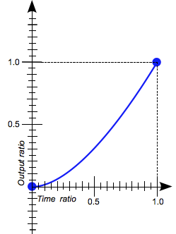
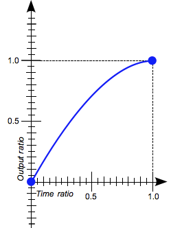

[[toc]]
# 引入样式的方式
**行内样式**
```html
<div style="">...</div>
```
**内部样式**
```html
<style>...</style>
```
**引入外部样式**
```html
<!-- src 为外部样式表的文件路径 -->
<link src="*.css">
```
**导入外部样式**
```html
<style>
    @import '*.css';
</style>
```
# 常用选择器
## 基础选择器
**全部选择器** 选择所有元素
```css
*{...}
```
**标签选择器** 选择指定的所有标签元素
```css
div{...}
```
**类选择器** 选择包含 class 属性值的所有元素
```css
.class{...}
```
**ID选择器** 选择包含 id 属性值的所有选择器
```css
#id{...}
```
> id 的值在同一个网页中应该时唯一的
## 复合选择器
**交集选择器** 同时满足两个以上条件的选择器
```css
/* <p class='red'> */
p.red{...}

/* class='red bold' */
.red.bold{...}

/* <div id='out'> */
div#out{...}
```
**并集选择器** 多个元素设置相同的属性
```css
/* 选择 ul 标签和 li 标签 */
ul,li{...}
```
**后代选择器** 选择所有的子元素，包含孙子级
```css
/* 
/*
<ul>
    <li>...</li> <== 可以选中
    <ol>
        <li>...</li> <== 可以选中
    </ol>
</ul>
*/
*/
ul li{...}
```
**父子选择器** 选择所有直接子元素，不包含孙子级
```css
/*
<ul>
    <li>...</li> <== 可以选中
    <ol>
        <li>...</li> <== 不能选中
    </ol>
</ul>
*/
ul>li{....}
```
**相邻兄弟选择器** 选择后面紧邻的兄弟元素
```css
/* 
<dl>
    <dd>...</dd> <== 不能选中
    <dt>...</dt>
    <dd>...</dd> <== 可以选中
    <dd>...</dd> <== 不能选中
</dl>
*/
dt+dd{...}
```
**兄弟选择器** 选择所有后面的兄弟元素
```css
/* 
<dl>
    <dd>...</dd> <== 不能选中
    <dt>...</dt>
    <dd>...</dd> <== 可以选中
    <dd>...</dd> <== 可以选中
</dl>
*/
dt~dd{...}
```
## 属性选择器
**包含属性** 选择所有包含指定属性的元素
```css
/* <input name=""> */
[name]{...}
```
**包含属性且值为固定值** 选择所有包含指定属性，且属性值等于指定值的元素
```css
/* <input type='text'> */
[type='text']{...}
```
**包含属性且值以指定字符串开头** 选择所有包含指定属性，且属性值以指定字符串开头的元素
```css
/* <a href='#css指南'> */
[href^='#']{...}
```
**包含属性且值包含指定的字符串** 选择所有包含指定属性，且属性值包含指定的字符串的元素
```css
/* <a href='css.html#css指南'> */
[href*='#']{...}
```
**包含属性且值以指定字符串结尾** 选择所有包含指定属性，且属性值以指定字符串结尾的元素
```css
/* <a href="mailto:123456@mail.com"> */
[href$='.com']{...}
```
## 伪类选择器
**超链接** 一般作用与超链接上的伪类
```css
/* 选择所有未被访问的链接 */
a:link{...}

/* 选择所有已被访问的链接 */
a:visited{...}

/* 选择活动的链接，鼠标按下但未释放 */
a:active{...}
```
**鼠标悬浮** 鼠标悬浮在元素上方时
```css
:hover{...}
```
**插入文本元素** 可以在元素前或后插入文本元素
```css
/* 在元素内容前插入文本元素 */
:before{
    content:''; /* 文本元素的文本内容 */
}

/* 在元素内容后插入内容 */
:after{
    content:''; /* 文本元素的文本内容 */
}
```
**选择内容** 选择指定的内容
```css
/* 选择首字母 */
::first-letter{...}

/* 选择首行 */
::first-line{...}

/* 选择用户选取的部分 */
::selection{...}
```
**表单元素** 一般用于表单元素的伪类
```css
/* 获取焦点 */
:focus{...}

/* 启用的元素 */
:enabled{...}

/* 禁用的元素 */
:disabled{...}

/* 选中的元素，只作用于复选框和单选框 */
:checked{...}
```
**取反** 不包含指定条件的伪类选择器
```css
/* div 下除了 p 元素以外的所有元素 */
div :not(p){...}

/* 所有为获取焦点的 input 元素 */
input:not(:focus){...}
```
**子元素** 用于选择子元素
```css
/* *********************** :first-child *********************** */
/* 
选择 dl 下第一个子元素
<dl>
    <dt>...</dt> <== 可以选中
    <dd>...</dd>
    <dt>...</dt>
    <dd>...</dd>
</dl>
*/
dl :first-child{...}

/* 
选择 dl 下的 dt 元素，且该元素为 dl 下的第一个子元素
<dl>
    <dt>...</dt> <== 可以选中
    <dd>...</dd>
    <dt>...</dt>
    <dd>...</dd>
</dl>
*/
dl dt:first-child{...}

/* 
选择 dl 下的 dd 元素，且该元素为 dl 下的第一个子元素
<dl>
    <dt>...</dt> <== 不能选中，不是 dd 元素
    <dd>...</dd> <== 不能选中，不是 dl 下的第一个子元素
    <dt>...</dt>
    <dd>...</dd>
</dl>
*/
dl dd:first-child{...}


/* *********************** :last-child *********************** */
/* 
选择 dl 下最后一个子元素
<dl>
    <dt>...</dt>
    <dd>...</dd>
    <dt>...</dt>
    <dd>...</dd> <== 可以选中
</dl>
*/
dl :last-child{...}

/* 
选择 dl 下的 dt 元素，且该元素为 dl 下的最后一个子元素
<dl>
    <dt>...</dt>
    <dd>...</dd>
    <dt>...</dt> <== 不能选中，不是 dl 下的最后一个子元素
    <dd>...</dd> <== 不能选中，不是 dt 元素
</dl>
*/
dl dt:last-child{...}

/* 
选择 dl 下的 dd 元素，且该元素为 dl 下的最后一个子元素
<dl>
    <dt>...</dt>
    <dd>...</dd>
    <dt>...</dt>
    <dd>...</dd> <== 可以选中
</dl>
*/
dl dd:last-child{...}


/* *********************** :first-of-type *********************** */
/* 
选择 dl 下第一个子元素
<dl>
    <dt>...</dt> <== 可以选中，dl 下第一个 dt 元素
    <dd>...</dd> <== 可以选中，dl 下第一个 dd 元素
    <dt>...</dt>
    <dd>...</dd>
</dl>
*/
dl :first-of-type{...}

/* 
选择 dl 下的 dt 元素，且该元素为 dl 下的第一个子元素
<dl>
    <dt>...</dt> <== 可以选中，dl 下第一个 dt 元素
    <dd>...</dd> <== 不能选中，因为该元素不是 dt 元素
    <dt>...</dt> <== 不能选中，因为该元素不是 dl 下第一个 dt 元素
    <dd>...</dd>
</dl>
*/
dl dt:first-of-type{...}


/* *********************** :last-of-type *********************** */
/* 
选择 dl 下最后一个子元素
<dl>
    <dt>...</dt>
    <dd>...</dd>
    <dt>...</dt> <== 可以选中，dl 下最后一个 dt 元素
    <dd>...</dd> <== 可以选中，dl 下最后一个 dd 元素
</dl>
*/
dl :last-of-type{...}

/* 
选择 dl 下的 dt 元素，且该元素为 dl 下的最后一个子元素
<dl>
    <dt>...</dt>
    <dd>...</dd>
    <dt>...</dt> <== 可以选中，dl 下最后一个 dt 元素
    <dd>...</dd> <== 不能选中，因为该元素不是 dt 元素
</dl>
*/
dl dt:last-of-type{...}


/* *********************** :only-child *********************** */
/* 
选择 dl 下的子元素，且该子元素为 dl 下的唯一子元素
<dl>
    <dd>...</dd> <== 可以选中
</dl>
<dl>
    <dt>...</dt>
    <dd>...</dd>
</dl>
*/
dl :only-child{...}

/* 
选择 dl 下的 dd 元素，且该 dd 元素为 dl 下的唯一子元素
<dl>
    <dd>...</dd> <== 可以选中
</dl>
<dl>
    <dt>...</dt>
    <dd>...</dd> <== 不能选中，该元素是不 dl  下的唯一元素
</dl>
*/
dl dd:only-child{...}


/* *********************** :only-of-type *********************** */
/* 
选择 dl 下的子元素，且该子元素的类型在 dl 中只有一个
<dl>
    <dd>...</dd> <== 可以选中
</dl>
<dl>
    <dt>...</dt> <== 可以选中
    <dd>...</dd> <== 不能选中，因为有在 dl 下有两个 dd 元素
    <dd>...</dd> <== 不能选中，因为有在 dl 下有两个 dd 元素
</dl>
*/
dl :only-of-type{...}

/* 
选择 dl 下的 dd 元素，且该 dd 元素为 dl 下唯一的一个 dd 元素
<dl>
    <dd>...</dd> <== 可以选中
</dl>
<dl>
    <dt>...</dt> <== 不能选中，因为该元素不是 dd 元素
    <dd>...</dd> <== 不能选中，因为有在 dl 下有两个 dd 元素
    <dd>...</dd> <== 不能选中，因为有在 dl 下有两个 dd 元素
</dl>
*/
dl dd:only-of-type{...}


/* *********************** :nth-child(n) *********************** */
/* 
选择 dl 下位置排名第2的子元素
<dl>
    <dt>...</dt>
    <dd>...</dd> <== 可以选中
    <dt>...</dt>
    <dd>...</dd>
</dl>
*/
dl :nth-child(2){...}

/* 
选择 dl 下位置排名第2的子元素，且该元素为 dd 元素
<dl>
    <dt>...</dt>
    <dd>...</dd> <== 可以选中
    <dt>...</dt>
    <dd>...</dd>
</dl>
*/
dl dd:nth-child(2){...}

/* 
选择 dl 下所有位置为奇数的子元素
<dl>
    <dt>...</dt> <== 可以选中
    <dd>...</dd>
    <dt>...</dt> <== 可以选中
    <dd>...</dd>
</dl>
*/
dl :nth-child(odd){...}

/* 
选择 dl 下所有位置为偶数的子元素
<dl>
    <dt>...</dt>
    <dd>...</dd> <== 可以选中
    <dt>...</dt>
    <dd>...</dd> <== 可以选中
</dl>
*/
dl :nth-child(even){...}


/* *********************** :nth-of-type(n) *********************** */
/* 
选择 dl 下类型排名第2的元素
<dl>
    <dt>...</dt>
    <dd>...</dd>
    <dt>...</dt> <== 可以选中
    <dd>...</dd> <== 可以选中
</dl>
*/
dl :nth-of-type(2){...}

/* 
选择 dl 下类型排名第2的子元素，且该元素为 dd 元素
<dl>
    <dt>...</dt>
    <dd>...</dd>
    <dt>...</dt> <== 不能选中，因为该元素不是 dd 元素
    <dd>...</dd> <== 可以选中
</dl>
*/
dl dd:nth-of-type(2){...}


/* *********************** :nth-last-child(n) *********************** */
/* 
选择 dl 下位置排名倒数第2的子元素
<dl>
    <dt>...</dt>
    <dd>...</dd>
    <dt>...</dt> <== 可以选中
    <dd>...</dd>
</dl>
*/
dl :nth-last-child(2){...}

/* 
选择 dl 下位置排名倒数第2的子元素，且该元素为 dd 元素
<dl>
    <dt>...</dt>
    <dd>...</dd>
    <dt>...</dt> <== 不能选中，因为该元素不是 dd 元素
    <dd>...</dd>
</dl>
*/
dl dd:nth-last-child(2){...}

/* *********************** :nth-last-of-type(n) *********************** */
/* 
选择 dl 下类型排名倒数第2的元素
<dl>
    <dt>...</dt> <== 可以选中
    <dd>...</dd> <== 可以选中
    <dt>...</dt>
    <dd>...</dd>
</dl>
*/
dl :nth-last-of-type(2){...}

/* 
选择 dl 下类型排名倒数第2的子元素，且该元素为 dd 元素
<dl>
    <dt>...</dt> <== 不能选中，因为该元素不是 dd 元素
    <dd>...</dd> <== 可以选中
    <dt>...</dt>
    <dd>...</dd>
</dl>
*/
dl dd:nth-last-of-type(2){...}
```

# 常用内容样式
## 文本
**文本颜色**
```css
color:#FFFFFF;
```
**字符间距**
```css
letter-spacing:10px;
```
**行高**
```css
line-height:30px;
```
**水平对齐方式** 只能作用域块级元素，对行内元素无效
```css
/* 水平居左 */
text-align:left;

/* 水平居中 */
text-align:center;

/* 水平居右 */
text-align:right;

/* 两端对齐，自动换行时有效 */
text-align:justify;
```
**文本修饰**
```css
/* 简写形式 */
text-decoration: 修饰线位置 修饰线风格 修饰线颜色;
text-decoration:none;/* 清空文本修饰 */
text-decoration: underline overline #F00;/* 设置上划线和下划线，线条颜色为红色 */

/* 设置修饰线位置 */
text-decoration-line:underline;/* 在文本的下方 */
text-decoration-line:overline;/* 在文本的上方 */
text-decoration-line:line-through;/* 贯穿文本中间 */

/* 修饰线风格 */
text-decoration-style:solid;/* 实线 */
text-decoration-style:double;/* 双实线 */
text-decoration-style:dotted;/* 点划线 */
text-decoration-style:dashed;/* 虚线 */
text-decoration-style:wavy;/* 波浪线 */

/* 修饰线颜色 */
text-decoration-color:#F00;
```
**首行缩进** 只能作用于块级元素
```css
/* 首行缩进2字符 */
text-indent:2em;
```
**文本阴影**
```css
/* 语法 */
text-shadow:X轴偏移量 Y轴偏移量 模糊圆角半径 阴影颜色;

/* 设置阴影颜色为黑色，X轴偏移1px，Y轴偏移1px,模糊半径2px */
text-shadow:1px 1px 2px #000;
```
**大小写字母转换** 仅对英文有效
```css
/* 转大写 */
text-transform:uppercase;

/* 转小写 */
text-transform:lowercase;

/* 取消转换 */
text-transform:none;
```
**空白符处理**
```css
/* 默认清空，合并连续的空白符为一个空白符，换行符也会当做空白符 */
white-space:normal;

/* 合并连续的空白符为一个空白符，不合并换行符*/
white-space:nowrap;

/* 不合并连续的空白符，也不会合并转换换行符 */
white-space:pre;
```
**单词间距** 仅对英文有效
```css
/* 设置单词的字间距为 10px */
word-spacing:10px;
```
**单词分割并换行规则**
```css
/* 在正常的单词结束处换行 */
overflow-wrap:normal;

/* 如果行内没有多余的地方容纳该单词到结尾，则那些正常的不能被分割的单词会被强制分割换行 */
overflow-wrap:break-word;
```
**文本样式**
```css
/* 简写语法 */
font:风格 粗细 大小 字体;

/* 字体风格 */
font-style：normal;/* 常规字体，默认值 */
font-style：italic;/* 斜体 */

/* 字体粗细 */
font-weight:normal;/* 正常粗细，默认值，与 400 等效 */
font-weight:bold;/* 粗体，与 700 等效 */
font-weight:lighter;/* 细体 */
font-weight:700;/* 使用数值进行调节粗细，数值可以为 1~1000，值越大字体越粗 */

/* 字体大小 */
font-size:10px;

/* 字体 */
font-family: Georgia, serif;/* 可以设置多个字体，越靠前的字体优先级越高 */
font-family: "Fira Mono","黑体";/* 设置带空格或中文字体，需要用引号包裹 */
```
**透明度** 取值范围为 0~1，0 为完全透明，1 为完全不透明
```css
/* 完全透明 */
opacity：0;

/* 完全不透明 */
opacity：1;

/* 半透明 */
opacity:0.5;
```
**垂直对齐方式** 仅对行内元素和单元格有效，或在图文混排时作用域图像上
```css
/* 基线对齐，默认值 */
vertical-align:baseline;

/* 顶部对齐 */
vertical-align:top;

/* 底部对齐 */
vertical-align:bottom;

/* 居中对齐 */
vertical-align:middle;

/* 基线上方 10px */
vertical-align:10px;
```
## 盒子
**类型**
```css
/* 更改盒子的类型为块级盒子 */
display:block;

/* 更改盒子的类型为行级盒子 */
display:inline;

/* 更改盒子的类型为行内块级盒子 */
display:inline-block;

/* 更改盒子的类型为单元格 */
display:table-cell;

/* 更改盒子的类型为动态盒子 */
display:flex;
```
**尺寸**
```css
/* 宽度 */
width:100px;

/* 高度 */
height:100px;

/* 最大宽度 */
max-width:300px;

/* 最大高度 */
max-height:300px;

/* 最小宽度 */
min-width:50px;

/* 最小高度 */
min-height:50px
```
**边框**
```css
/* 设置四边边框 */
/* 简写语法 */
border:线宽 风格 颜色;
/* 设置线宽 */
border-width:1px;
/* 设置风格 */
border-sytle:dotted; /* 圆点 */
border-sytle:dashed; /* 虚线 */
border-sytle:solid; /* 实线 */
border-sytle:double; /* 双实线 */
border-sytle:groove; /* 有雕刻效果的边框 */
border-sytle:ridge; /* 有浮雕效果的边框 */
border-sytle:inset; /* 有陷入效果的边框 */
border-sytle:outset; /* 有突出效果的边框 */
/* 设置边框颜色 */
border-color:#F00;

/* 设置上下边框和左右边框 */
border-width:1px 2px;
border-sytle:solid dotted;
border-color:#F00 #00F;

/* 设置上边框、左右边框和下边框 */
border-width:1px 2px 3px;
border-sytle:solid dotted dashed;
border-color:#F00 #00F #0FF;

/* 设置上边框、右边框、下边框和左边框 */
border-width:1px 2px 3px 4px;
border-sytle:solid dotted dashed double;
border-color:#F00 #00F #0FF #000;

/* 设置单边框简写语法 */
/* 上边框 */
border-top:粗细 风格 颜色;
border-top-width:1px;
border-top-style:solid;
border-top-color:#F00;
/* 右边框 */
border-right:粗细 风格 颜色;
border-right-width:1px;
border-right-style:solid;
border-right-color:#F00;
/* 下边框 */
border-bottom:粗细 风格 颜色;
border-bottom-width:1px;
border-bottom-style:solid;
border-bottom-color:#F00;
/* 左边框 */
border-left:粗细 风格 颜色;
border-left-width:1px;
border-left-style:solid;
border-left-color:#F00;

/* 边框圆角 */
/* 设置四个角 */
border-radius：左上角半径 右上角半径 右下角半径 左下角半径;
/* 设置左上角 */
border-top-left-radius:10px;
/* 设置右上角 */
border-top-right-radius:10px;
/* 设置左下角 */
border-bottom-left-radius:10px;
/* 设置右下角 */
border-bottom-right-radius:10px;

/* 盒子阴影 */
box-shadow: X轴偏移量 Y轴偏移量 阴影半径 模糊半径 阴影颜色;
box-shadow: 1px 1px 2px 1px #F00;
```
## 背景
```css
/* 简写 */
background:背景颜色 背景图像 平铺方式 背景图像定位;

/* 背景颜色 */
background-color:#F00;

/* 背景图像 */
background-image:url('*.jpg');

/* 背景平铺方式 */
background-repeat:repeat;/* 沿X轴和Y轴平铺，图像大小不变，超出部分会被裁剪掉 */
background-repeat:round;/* 沿X轴和Y轴平铺，图像大小会调整到正好填充的大小 */
background-repeat:no-repeat;/* 不平铺 */
background-repeat:repeat-x;/* 沿X轴平铺，图像大小不变，超出部分会被裁剪掉 */
background-repeat:repeat-y;/* 沿Y轴平铺，图像大小不变，超出部分会被裁剪掉 */

/* 背景图像定位 */
background-position:center; /* 水平方向和垂直方向都居中对齐 */
background-position:top; /* 水平方向居中对齐，垂直方向顶部对齐 */
background-position:bottom; /* 水平方向居中对齐，垂直方向底部对齐 */
background-position:left; /* 水平方向左侧对齐，垂直方向居中对齐 */
background-position:right; /* 水平方向右侧对齐，垂直方向居中对齐 */
background-position:50px; /* 水平向左侧偏移 50px，垂直方向居中 */
background-position:-50px; /* 水平向右侧偏移 50px，垂直方向居中 */
background-position:10px 10px; /* 水平方向偏移 10px，垂直方向偏移 10px */
background-position:left top; /* 水平方向左对齐，垂直方向顶部对齐 */

/* 固定背景图像 */
background-attachment:fixed; /* 背景固定，不会随着元素内容滚动而滚动 */
background-attachment:local; /* 背景不固定，会随着元素内容滚动而滚动 */

/* 背景图像裁剪方式 */
background-clip:border-box; /* 背景延伸至边框外沿 */
background-clip:padding-box; /* 背景延伸至内边距外沿 */
background-clip:content-box; /* 背景被裁剪至内容区外沿 */

/* 背景图像定位区域 */
background-origin:border-box;/* 背景图像圆点为 border 的原点 */
background-origin:padding-box;/* 背景图像圆点为 padding 的原点 */
background-origin:content-box;/* 背景图像圆点为 content 的原点 */

/* 背景图像尺寸 */
background-size:100px;/* 宽为 100px，高等比缩放 */
background-size:100px 100px;/* 宽为 100px，高为 100px */
background-size:auto;/* 背景图片原有尺寸 */
background-size:cover;/* 缩放背景图片以完全覆盖背景区，超出部分裁剪，保证宽或高完全显示 */
background-size:contain;/* 缩放背景图片以完全装入背景区，背景区可能会有空白  */
```
## 列表
```css
/* 缩写形式 */
list-style:列表风格 标记图像 标记定位;
list-style:none; /* 清除所有列表样式 */

/* 列表风格 */
list-style-type:disc; /* 实心圆点 (默认值) */
list-style-type:circle; /* 空心圆点 */
list-style-type:square; /* 实心方块 */
list-style-type:decimal; /* 十进制阿拉伯数字，从1开始 */
list-style-type:decimal-leading-zero; /* 十进制阿拉伯数字，从01开始 */
list-style-type:lower-roman; /* 小写罗马数字，从i开始 */
list-style-type:upper-roman; /* 大写罗马数字，从I开始 */
list-style-type:lower-greek; /* 小写古希腊文，从α开始 */
list-style-type:lower-latin; /* 小写英文字母，从a开始 */
list-style-type:upper-latin; /* 大写英文字母，从A开始 */

/* 标记图像 */
list-style-image:url(*.jpg);

/* 标记定位 */
list-style-position:outside; /*标记盒在主块盒的外面*/
list-style-position:inside; /*标记盒是主要块盒中的第一个行内盒，处于元素的内容流之后*/
```
## 表格
```css
/* 是否合并表格边框 */
border-collapse:separate;/* 不合并，默认值 */
border-collapse:collapse;/* 合并 */

/* 相邻单元格边框之间的距离 */
border-spacing:10px; /* 单元格的间距为 10px */
border-spacing:10px 20px; /* 单元格的水平间距为 10px，垂直间距为 20px */

/* 规定表格标题的位置 */
caption-side:top; /* 标题会出现在表格的上方 */
caption-side:bottom; /* 标题会出现在表格的下方 */

/* 是否显示表格中的空单元格上的边框和背景 */
empty-cells:show; /* 边框和背景正常渲染。与普通元素一样 */
empty-cells:hide; /* 边框和背景被隐藏 */

/* 表格的布局算法 */
table-layout:auto; /* 自动布局，表格及单元格的宽度取决于包含内容的宽度 */
table-layout:fixed; /* 固定布局，表格和列的宽度通过表格的宽度来设置，某一列的宽度由首列的宽度决定 */
```
# 常用布局样式
## 边距
**外边距** 元素边框意外的距离
```css
/* 四边外边距 */
margin:10px;/* 上下左右外边距均为 10px */
margin:10px 20px; /* 上下外边距为 10px，左右外边距为 20px */
margin:10px 20px 30px; /* 上外边距为 10px，左右外边距为 20px，下外边距为 30px */
margin:10px 20px 30px 40px; /* 上外边距为 10px，右外边距为 20px，下外边距为 30px，左外边距为 40px */

/* 单边外边距 */
margin-top:10px;/* 上外边距为 10px */
margin-right:10px;/* 右外边距为 10px */
margin-bottom:10px;/* 下外边距为 10px */
margin-left:10px;/* 左外边距为 10px */
```
**内边距** 元素边框与内容之间的距离
```css
/* 四边内边距 */
padding:10px;/* 上下左右内边距均为 10px */
padding:10px 20px; /* 上下内边距为 10px，左右内边距为 20px */
padding:10px 20px 30px; /* 上内边距为 10px，左右内边距为 20px，下内边距为 30px */
padding:10px 20px 30px 40px; /* 上内边距为 10px，右内边距为 20px，下内边距为 30px，左内边距为 40px */

/* 单边内边距 */
padding-top:10px;/* 上内边距为 10px */
padding-right:10px;/* 右内边距为 10px */
padding-bottom:10px;/* 下内边距为 10px */
padding-left:10px;/* 左内边距为 10px */
```
## 浮动
**浮动**
```css
/* 元素左浮动 */
float:left;

/* 元素右浮动 */
float:right;
```
**清除浮动**
```css
/* 左侧不允许有浮动元素 */
clear:left;

/* 右侧不允许有浮动元素 */
clear:right;

/* 两侧都不能有浮动元素 */
clear:both;
```
## 定位
**定位类型**
```css
/* 相对定位 */
position:relative;

/* 绝对定位 */
position:absolute;

/* 固定定位 */
position:fixed;
```
**定位偏移**
```css
/* 元素顶部距离上方的偏移量 */
top:10px;

/* 元素的底部距离下方的偏移量 */
bottom:10px;

/* 元素右侧距离右方的偏移量 */
right:10px;

/* 元素左侧距离左方的偏移量 */
left:10px;
```
**堆叠顺序** 值越大，越靠上
```css
z-index:1;
```
## 动态盒子
**是元素成为动态盒子** 设置在父级元素
```css
display:flex;
```
**盒子内容的排列方向** 设置在父级元素
```css
/* 子盒子水平排列 */
flex-direction:row;

/* 子盒子反向水平排列 */
flex-direction:row-reverse;

/* 子盒子垂直排列 */
flex-direction:column;

/* 子盒子反向垂直排列 */
flex-direction:row-reverse;
```
**子盒子的所占的空间** 设置在子级元素
```css
/* 
<div>
    <h1>...</h1>
    <h2>...</h2>
    <h3>...</h3>
</div>
*/
/* 指定占父级空间的份数 */
div{display:flex;}
h1{flex:1} /* h1 占 1 份 */
h2{flex:2} /* h2 占 2 份 */
h3{flex:3}/* h3 占 3 份 */

/* 填充父级空间 */
div{display:flex;}
h1{flex:1}/* h1 占父级剩余空间 */
```
**子盒子排列方式** 设置在父级元素
```css
/* 左侧或顶部排列 */
justify-content:start;

/* 右侧或底部排列 */
justify-content:flex-end;

/* 水平或垂直居中排列 */
justify-content:center;

/* 水平或垂直两端排列 */
justify-content:space-between;

/* 水平或垂直环绕排列 */
justify-content:space-around;
```
**子盒子单双行显示设置** 设置在父级元素
```css
/* 单行显示 */
flex-wrap:nowrap;

/* 多行显示，会自动换行 */
flex-wrap:wrap;
```
**子盒子在父级元素垂直方向布局** 设置在子级元素
```css
/* 顶端或左侧对齐 */
align-self:flex-start;

/* 底端或右侧对齐 */
align-self:flex-end;

/* 居中对齐 */
align-self:center;
```
# 常用动画样式
## 变形
**旋转**
```css
/* 顺时针旋转10度 */
transform:rotate(10deg);

/* 逆时针旋转10度 */
transform:rotate(-10deg);
```
**缩放**
```css
/* 缩放1.1倍，变大 */
transform:scale(1.1);

/* 缩放0.1倍，变小 */
transform:scale(0.1);

/* X轴缩放1.1倍，Y轴缩放0.1倍 */
transform:scale(1.1, 0.1);
```
**位移**
```css
/* X轴位移 10px */
transform:translate(10px);

/* X轴位移 10px，Y轴位移 20px */
transform:translate(10px, 20px);
```
**倾斜**
```css
/* X轴倾斜 10 度 */
transform:skew(10deg);

/* X轴倾斜 10 度, Y轴倾斜 10 度 */
transform:skew(10deg, 10deg);
```
**设置变形原点**
```css
/* 原点在元素中心 */
transform-origin:center;

/* 原点在元素左上角 */
transform-origin:top left;

/* 原点在元素左下角 */
transform-origin:bottom left;

/* 原点在元素右上角 */
transform-origin:top right;

/* 原点在元素右下角 */
transform-origin:bottom right;

/* 原点在元素 50px,50px 的位置 */
transform-origin:50px 50px;
```

## 过度
**基本语法**
```css
transition:属性名 过度时间;
transition:属性名 过度时间 延迟时间;
transition:属性名 过度时间 过度函数 延迟时间;
transition:属性名1 过度时间, 属性名2 过度时间;

/* 所有属性 */
transition:all 过度时间;

/* 案例 */
transition: all  0.5s ease-in-out 1s;
```
**过度函数**
关键词|图示|说明
-|-|-
`linear`||恒速
`ease`||开始和结束速度块，中间速度慢慢
`ease-in`||开始缓慢，逐渐加速
`ease-in-out`||开始逐渐加速，最后逐渐减速
`ease-out`||快速开始，缓慢结束
`step-start`|.png)|立即跳到结束位置
`step-end`|.png)|保持初始状态

## 自定义动画
**语法**
```css
animation:动画名称 动画时间 过度函数 延迟时间 播放次数 动画方向 填充模式; 
animation:动画名称 动画时间 过度函数 延迟时间; 
animation:动画名称 动画时间; 

/* 案例 */
animation:slidein 3s ease-in 1s 2 reverse both paused;
@keyframes slidein {
  from { transform: scaleX(0); }
  to   { transform: scaleX(1); }
}
```
**播放次数**
值|说明
-|-
数值|具体的次数，例如：1为播放1次，0.5为播放一半
infinite|无限循环播放

**动画方向** 动画播放的方向，正向播放还是反向播放
值|说明
-|-
normal|默认值，每次都从头开始播放动画
alternate|第一次正向播放动画，第二次反向播放动画，以此类推
reverse|每次都反向播放动画
alternate-reverse|第一次反向播放动画，第二次正向播放动画，以此类推
**填充模式** 动画停止后，目标元素所在的样式
值|说明
-|-
forwards|应用最后一帧的样式
backwards|应用第一帧的样式
both|正向播放停留在最后一帧，反向播放停留在第一帧
**动画规则**
```css
@keyframes 动画名称{
    form{...} /* 起始状态 */
    to{...} /* 结束状态 */
}

@keyframes 动画名称{
    0%{...} /* 起始状态 */
    30%{...} /* 动画运行到 30% 时的状态 */
    60%{...} /* 动画运行到 60% 时的状态 */
    100%{...} /* 结束状态 */
}
```

# FAQ
## 如何解决样式表中的中文乱码
```css
/* 必须放在第一行 */
@charset 'utf-8';
```
## 如何让块级元素网页水平居中
```css
/* 
<body>
    <div>...</div>
</body>
*/
div{
    width:500px;
    margin:0 auto;
}
```
## 如何让文本垂直居中
```css
/* 单行文本 */
div{
    width:100%;
    height:300px;
    line-height:300px; /* 文本行高和高度保持一致 */
}

/* 多行文本 */
div{
    width:100%;
    height:300px;
    display:table-cell;
    vertical-align:middle;
}
```

## 取消图片下方的空白行
```css
/* 
给图片的父级元素设置 
<div>
    
</div>
*/
div{
    font-size:0; 
}
```

## 图文混排时，图文如何垂直居中
```css
/* 
文本内容
*/
img{
    vertical-align:middle;
}
```